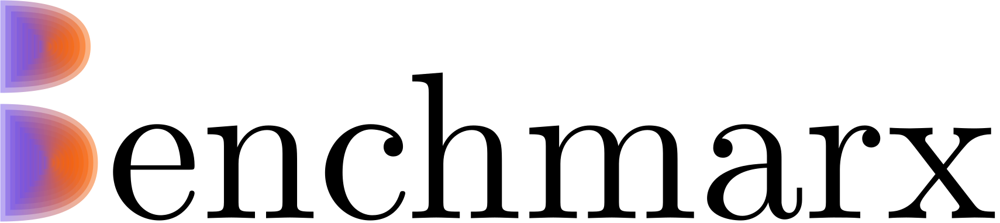

# Benchmarx: Benchmarking Optimization Methods with Jax

Benchmarx is a Python library that enables you to benchmark various optimization methods in a reproducible manner using the Jax library. It provides a flexible framework for comparing the performance of different optimization algorithms on a wide range of optimization problems.

## Features

- Benchmarx allows you to easily benchmark optimization algorithms provided by the [Jaxopt](https://github.com/google/jaxopt) library as well as custom algorithms.
- Reproducibility is ensured by providing a comprehensive set of parameters to control the benchmarking process, including RNG states.
- Comes with a collection of standard optimization problems, making it simple to evaluate algorithms on diverse tasks.
- Supports tracking and visualization of key metrics such as function values, gradient norms(if possible) and solution trajectories.
- Generate customizable plots and reports to aid in analyzing and presenting benchmark results with [plotly](https://github.com/plotly/plotly.py) library.
- All the data from the experiments could be saved in the json or pandas format for the later analysis.

## Installation

You can install Benchmarx using pip:

```bash
pip install benchmarx
```

## Usage

To be done

## Examples

Refer to the examples provided in the repository for details on how to use this package.

- Gradient Descent on Quadratic problem [](https://colab.research.google.com/drive/13bX2ZeOASEEKBWSbaTeY0Sm5g3ImaoLk?usp=sharing)

- Gradient Descent with custom Line Search [](https://colab.research.google.com/drive/1me6sE5W7SML6Ww-pBgpjmlJBKz8x3qUv?usp=sharing)

- Your own custom method [](https://colab.research.google.com/drive/1DCNgjb3_9ITQy93dZg0fUbV2BRB_MuLL?usp=sharing)

- Your own custom metric and interactive chart [](https://colab.research.google.com/drive/12I_T09gELjZlslOP8nRV4v2ght2R6vDX?usp=sharing)

- Stochastic Gradient Descent on Quadratic Problem [](https://colab.research.google.com/drive/1bD7eM9NNZqEvMjlTl6OKvN_vcmtHSMAd?usp=sharing)

- Quadratic Problem based on real data [](https://colab.research.google.com/drive/1k3-ul8o9_wdsNko51t0-UNpHOwTemJ6o?usp=sharing)

- Neural Network training [](https://colab.research.google.com/drive/1W2vP5NRCnv6aFVgSm9pzmWZ7l0i3SCmm?usp=sharing)

## Documentation

Check out the full documentation at [benchmarx.fmin.xyz](https://benchmarx.fmin.xyz).


## Contribution

Contributions are welcome! If you have any suggestions or issues, feel free to open an issue or submit a pull request.